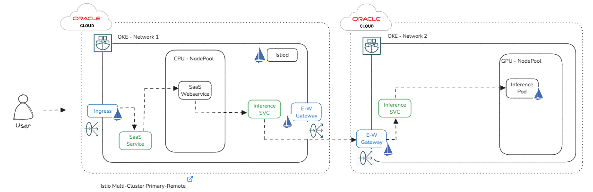

# Sample Istio Multi-cluster deployment in OKE

## Introduction

The purpose of this repo is to document the steps required to configure a [multi-cluster service mesh](https://istio.io/latest/docs/setup/install/multicluster/primary-remote_multi-network/) using Istio.




## Prerequisites

Create two OKE clusters with public endpoint, private worker nodes, flannel CNI. Ideally, configure the two clusters in different OCI regions (`eu-frankfurt-1` and `us-ashburn-1` are used in this demo).

Create the kubeconfig files and set the cluster contexts as `fra` and `ash`.

Ensure the required kernel modules to run istio are loaded. You can use the following cloud-init script.

    #!/bin/bash
    curl --fail -H "Authorization: Bearer Oracle" -L0 http://169.254.169.254/opc/v2/instance/metadata/oke_init_script | base64 --decode >/var/run/oke-init.sh
    bash /var/run/oke-init.sh

    # Load required kernel modules
    modprobe br_netfilter
    modprobe nf_nat
    modprobe xt_REDIRECT
    modprobe xt_owner
    modprobe iptable_nat
    modprobe iptable_mangle
    modprobe iptable_filter

    # Ensure modules are loaded on reboot
    cat <<EOF > /etc/modules-load.d/istio-modules.conf
    br_netfilter
    nf_nat
    xt_REDIRECT
    xt_owner
    iptable_nat
    iptable_mangle
    iptable_filter
    EOF

    echo done


For cluster provisioning you will need to execute the following commands with `terraform`.

    cd oke-cluster1
    terraform init
    terraform apply --auto-approve
    cd ..

    cd oke-cluster2
    terraform init
    terraform apply --auto-approve
    cd ..

## Setup

Export the cluster contexts as environment variables:

    export CTX_CLUSTER1=fra
    export CTX_CLUSTER2=ash

Regarding the [trust](https://istio.io/latest/docs/setup/install/multicluster/before-you-begin/#configure-trust) configuration, we will use the cluster in Frankfurt as Primary.

Set the default network for cluster1 to `fra`.

    ( kubectl --context="${CTX_CLUSTER1}" get namespace istio-system || \
    kubectl --context="${CTX_CLUSTER1}" create namespace istio-system ) && \
    kubectl --context="${CTX_CLUSTER1}" label namespace istio-system topology.istio.io/network=network1

Update the Public LB NSG in the `cluster1.yaml` file.

Configure `fra` as primary:

    istioctl install --context="${CTX_CLUSTER1}" -f cluster1.yaml

Setup the east-west gateway in `fra`.  Replace the NSG below with the Pub LB NSG OCID for `fra`.

    bash gen-eastwest-gateway.sh \
    --network network1 --pub-lb-nsg ocid1.networksecuritygroup.oc1.eu-frankfurt-1.aaaaaaaaj5opelxnb6fcxmvj7eqo3rg2plirw3zlouz2nhgz2aqszujhgkeq | \
    istioctl --context="${CTX_CLUSTER1}" install -y -f -

Wait for the east-west gateway to get an IP address assigned:

    kubectl --context="${CTX_CLUSTER1}" get svc istio-eastwestgateway -n istio-system

Expose the control plane in `fra`.

    kubectl apply --context="${CTX_CLUSTER1}" -n istio-system -f expose-istiod.yaml

Set the control plane cluster for `ash`.

    ( kubectl --context="${CTX_CLUSTER2}" get namespace istio-system || \
    kubectl --context="${CTX_CLUSTER2}" create namespace istio-system ) && \
    kubectl --context="${CTX_CLUSTER2}" annotate namespace istio-system topology.istio.io/controlPlaneClusters=fra

Configure the default network for `ash`.

    kubectl --context="${CTX_CLUSTER2}" label namespace istio-system topology.istio.io/network=network2

Configure `ash` as remote cluster.

    export DISCOVERY_ADDRESS=$(kubectl \
    --context="${CTX_CLUSTER1}" \
    -n istio-system get svc istio-eastwestgateway \
    -o jsonpath='{.status.loadBalancer.ingress[0].ip}')

    cat <<EOF > cluster2.yaml
    apiVersion: install.istio.io/v1alpha1
    kind: IstioOperator
    spec:
      profile: remote
      values:
        istiodRemote:
          injectionPath: /inject/cluster/ash/net/network2
        global:
          remotePilotAddress: ${DISCOVERY_ADDRESS}
    EOF

    istioctl install --context="${CTX_CLUSTER2}" -f cluster2.yaml

Attach `ash` as remote cluster to `fra`.

To attach the remote cluster to its control plane, we give the control plane in `fra` access to the API Server in `ash`. This will do the following:

Enables the control plane to authenticate connection requests from workloads running in `ash`. Without API Server access, the control plane will reject the requests.

Enables discovery of service endpoints running in `ash`.

Because it has been included in the topology.istio.io/controlPlaneClusters namespace annotation, the control plane on `fra` will also:

- Patch certs in the webhooks in `ash`.
- Start the namespace controller which writes configmaps in namespaces in `ash`.

```
istioctl create-remote-secret \
    --context="${CTX_CLUSTER2}" \
    --name=ash | \
    kubectl apply -f - --context="${CTX_CLUSTER1}"
```

Setup the east-west gateway in `ash`. Replace the NSG below with the Pub LB NSG OCID for `ash`.

    bash gen-eastwest-gateway.sh \
    --network network2 --pub-lb-nsg ocid1.networksecuritygroup.oc1.iad.aaaaaaaa55spgqftkeadsf7633wua2dt2az5da6c3nwpkysyc4oypoewklvq |  \
    istioctl --context="${CTX_CLUSTER2}" install -y -f -

Wait for the east-west gateway to get an IP address:

    kubectl --context="${CTX_CLUSTER2}" get svc istio-eastwestgateway -n istio-system

Expose the services in `fra` and `ash`.

    kubectl --context="${CTX_CLUSTER1}" apply -n istio-system -f expose-services.yaml

## Setup observability

Install `prometheus`.

    kubectl apply -f https://raw.githubusercontent.com/istio/istio/release-1.24/samples/addons/prometheus.yaml

Install `kiali`.

    kubectl apply -f https://raw.githubusercontent.com/istio/istio/release-1.24/samples/addons/kiali.yaml

To vizualize the Cluster Mesh using Kiali follow this guide: https://istio.io/latest/docs/tasks/observability/kiali/

## Test the services

Create the `sample` namespace in both clusters.


    kubectl create --context="${CTX_CLUSTER1}" namespace sample
    kubectl create --context="${CTX_CLUSTER2}" namespace sample

Enable the automatic sidecar injection for the `sample` namespace.

    kubectl label --context="${CTX_CLUSTER1}" namespace sample \
        istio-injection=enabled
    kubectl label --context="${CTX_CLUSTER2}" namespace sample \
        istio-injection=enabled

Create the `helloworld` service in both clusters.

    kubectl apply --context="${CTX_CLUSTER1}" \
    -f hello-world.yaml \
    -l service=helloworld -n sample
    kubectl apply --context="${CTX_CLUSTER2}" \
    -f hello-world.yaml \
    -l service=helloworld -n sample

Create the `helloworld` deployment in `fra`.

    kubectl apply --context="${CTX_CLUSTER1}" \
    -f hello-world.yaml \
    -l version=v1 -n sample

Create the `helloworld` deployment in `ash`.

    kubectl apply --context="${CTX_CLUSTER2}" \
    -f hello-world.yaml \
    -l version=v2 -n sample

Deploy `curl` in both clusters.

    kubectl apply --context="${CTX_CLUSTER1}" \
    -f curl.yaml -n sample
    kubectl apply --context="${CTX_CLUSTER2}" \
    -f curl.yaml -n sample

Verify the status of the `curl` pods:

    kubectl get pod --context="${CTX_CLUSTER1}" -n sample -l app=curl

    kubectl get pod --context="${CTX_CLUSTER2}" -n sample -l app=curl

Verify the cross cluster traffic:

    kubectl exec --context="${CTX_CLUSTER1}" -n sample -c curl \
    "$(kubectl get pod --context="${CTX_CLUSTER1}" -n sample -l \
    app=curl -o jsonpath='{.items[0].metadata.name}')" \
    -- curl -sS helloworld.sample:5000/hello


## AI Application Demo

We will setup:
- [Open WebUI](https://github.com/open-webui/open-webui) in `fra`.
- self-hosted LLM using [sglang](https://github.com/sgl-project/sglang) in `ash`.
- configure Ingress to expose the Open WebUI service
- cluster mesh will enable the connection of Open WebUI hosted in `fra` to the LLM service running in `ash`.

Create the demo namespace

    kubectl create --context="${CTX_CLUSTER1}" namespace demo
    kubectl create --context="${CTX_CLUSTER2}" namespace demo

Enable istio sidecar injection for namespace demo

    kubectl label --context="${CTX_CLUSTER1}" namespace demo \
        istio-injection=enabled
    kubectl label --context="${CTX_CLUSTER2}" namespace demo \
        istio-injection=enabled

Install SGlang in `ash`

    # Store HuggingFace token into a K8s secret:
    export $HF_TOKEN=hf_...

    kubectl create secret generic hf-secret --from-literal=HF_TOKEN=$HF_TOKEN
    kubectl apply -n demo -f sglang.yaml --context="${CTX_CLUSTER2}"

Create SGlang service in `fra`

    kubectl apply -n demo -l obj=sglang-service -f sglang.yaml --context="${CTX_CLUSTER1}"

Install Open WebUI

    helm repo add open-webui https://helm.openwebui.com/
    helm repo update

    helm upgrade --install --namespace demo open-webui open-webui/open-webui -f open-webui-values-override.yaml

Setup `cert-manager` in `fra`:
    
    helm install cert-manager jetstack/cert-manager --namespace cert-manager --create-namespace --set installCRDs=true --kube-context="${CTX_CLUSTER1}"

Create cluster issuer:

    kubectl apply -f demo-cluster-issuer.yaml --context="${CTX_CLUSTER1}"

Update the hostname in the files:

- `demo-certificate.yaml`
- `demo-gateway.yam`
- `demo-virtual-service.yaml`

Create the certificate:
    
    kubectl apply -f demo-certificate.yaml --context="${CTX_CLUSTER1}"

Create the gateway:

    kubectl apply -f demo-gateway.yaml --context="${CTX_CLUSTER1}"

Create the virtual service:

    kubectl apply -f demo-virtual-service.yaml -n demo --context="${CTX_CLUSTER1}"


At this moment, the service should be available at the configured hostname.

## Cleanup

Cleanup `fra`:

    kubectl delete --context="${CTX_CLUSTER1}" -f https://raw.githubusercontent.com/istio/istio/release-1.24/samples/addons/prometheus.yaml

    kubectl delete --context="${CTX_CLUSTER1}" -f https://raw.githubusercontent.com/istio/istio/release-1.24/samples/addons/kiali.yaml

    helm uninstall --kube-context="${CTX_CLUSTER1}" --namespace demo open-webui 

    helm uninstall --kube-context="${CTX_CLUSTER1}" --namespace cert-manager cert-manager 

    kubectl delete --context="${CTX_CLUSTER1}"  -n demo -f sglang.yaml

    kubectl delete --context="${CTX_CLUSTER1}" namespace demo

    kubectl delete --context="${CTX_CLUSTER1}" namespace sample

    istioctl uninstall --context="${CTX_CLUSTER1}" -y --purge
    kubectl delete ns istio-system --context="${CTX_CLUSTER1}"


Cleanup `ash`:

    kubectl delete --context="${CTX_CLUSTER2}" -f https://raw.githubusercontent.com/istio/istio/release-1.24/samples/addons/prometheus.yaml

    kubectl delete --context="${CTX_CLUSTER2}" -f https://raw.githubusercontent.com/istio/istio/release-1.24/samples/addons/kiali.yaml

    helm uninstall --kube-context="${CTX_CLUSTER2}" --namespace demo open-webui 

    helm uninstall --kube-context="${CTX_CLUSTER2}" --namespace cert-manager cert-manager 

    kubectl delete --context="${CTX_CLUSTER2}"  -n demo -f sglang.yaml

    kubectl delete --context="${CTX_CLUSTER2}" namespace demo

    kubectl delete --context="${CTX_CLUSTER2}" namespace sample

    istioctl uninstall --context="${CTX_CLUSTER2}" -y --purge
    kubectl delete ns istio-system --context="${CTX_CLUSTER2}"

Remove the clusters:
    
    cd oke-cluster1
    terraform destroy --auto-approve
    cd ..

    cd oke-cluster2
    terraform destroy --auto-approve
    cd ..

## References

[1] https://istio.io/latest/docs/setup/install/multicluster/before-you-begin/

[2] https://istio.io/latest/docs/setup/install/multicluster/verify/